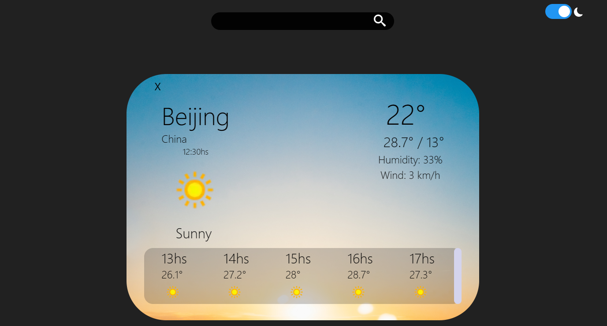
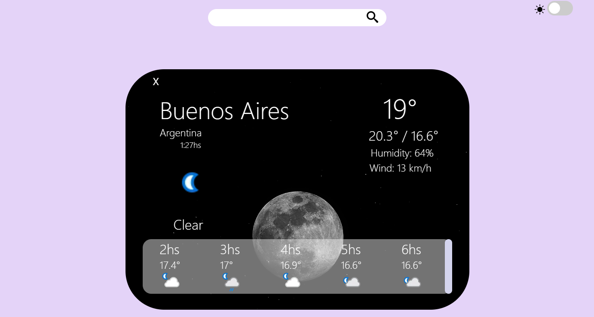

Hola! 
Esta es una web del clima que realice como primer proyecto en react js. Utiliza redux para el manejo de estados globales, y modules.css para los estilos. 
Para correr el proyecto se debe ejectuar *npm install* en la carpeta raiz, y *npm start* para correrlo en la web. 
 

Hello everyone!
This is a weather web that i realize as first project in react js. Using redux to handle the local state, and modules.css for styles. 
To run the proyect you have to use *npm install* in the root folder, and *npm start* to run.

DEPLOY: https://weather-f6pc.vercel.app/

 
 
 

